# FTP Servers Practice
- A simple FTP server configured, for anonymous users only (IP: 192.168.56.10).
- A secure FTP server with a self-signet SSL certificate, for local users (IP: 192.168.56.20).

## Anonymous FTP server features:
- Anonymous access only.
- No write permissions (read-only).
- Max 200 simultaneous connections.
- 50KB/s bandwidth limit per user.
- 30-second inactivity timeout.
- IPv4 only.

## Secure FTP server features:
- Local users access with password.
- Chroot jail for some users.
- Max 15 simultaneous connections.
- 5MB/s bandwidth limit for local users.
- 2MB/s bandwidth limit for anonymous users.
- 720-second inactivity timeout.
- IPv4 only.

## General requirements:
- Virtualbox.
- Vagrant.
- Ansible.
- FTP tool.
- FTP graphic client (optional).
- Internet connection.
If you don’t have them installed, you could set them up with:

### Linux:
```bash
sudo apt update && sudo apt upgrade -y
sudo apt install -y virtualbox 
sudo apt install -y vagrant
sudo apt install -y ansible
sudo apt install -y ftp
```

### Windows:
Incompatibility because of ansible tool.

## Quick setup.
### 1. Install requirements:
```bash
# install the necesary requirements previusly mentioned...
sudo apt install vsftpd -y
```
### 2. Clone and run:
```bash
git clone https://github.com/gustavohermed/FTP-Proyect.git
cd FTP-Proyect
vagrant up
```
### 3. Connect to FTP:
```bash
ftp 192.168.56.10
# Username: anonymous
# Password: (press Enter)
-or-
ftp 192.168.56.20
# Username: <luis/maria/miguel>
# Password: "SecurePass123"
```
### 4. Simple FTP usage:
```bash
# List available files
ls

# Download a file
get WELCOME.txt

# Upload a file
put <file name>

# Create a directory
mkdir <directory name>

# Move between directories
cd <route>
```
### (Optional). Shut down and unistallation:
```bash
vagrant halt
vagrant destroy -f
```

## Troubleshooting.
### 1. Conecting with the FTP server:
If you can't stablish connection with any of the FTP servers; firts check if service is running properly in the VMs.
```bash
systemctl status vsftpd
sudo systemctl restart vsftpd
```
If the problem didn't solve, try checking if your 21 port is listening in your host machine.
```bash
ss -tuln | grep :21
```
### 2. Problems with the SSL certifie on graphic client:
If, while trying to establish connection with a graphic client, like fileZilla, you encounter an error about SSL or TLS; check on the official web page of that client, the compatible SSL or TLS versions. 
Then, in the VMs, go to /etc/vsftpd.conf and change the configuration for a proper one (the compatibility versions stablished rightnow are for the ultimate version of fileZilla_3.69.5)

## Documentation.

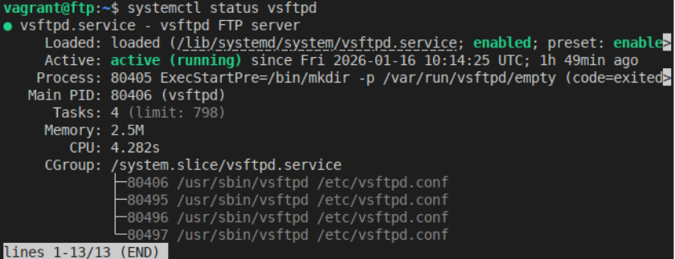<br>
Before doing any testing, and after the vagrant up has finished, we checked that our VMs, vsftpd service, is working properly.
<br>
<br>

<br>
And ofcourse we checked that the 21 port of our host machine is active and listening. 
<br>
<br>

### Anonymous FTP server:

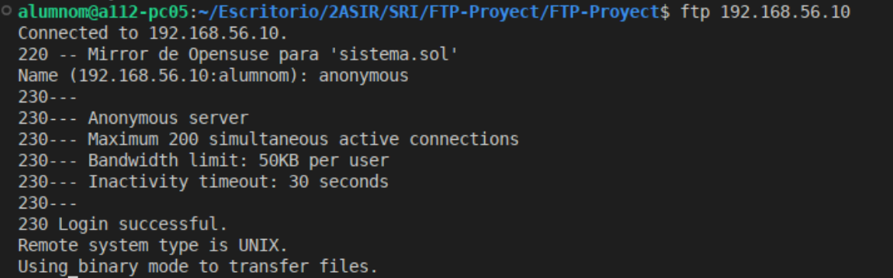<br>
After configuring and setting up the anonymous server, we tried to connect trough the command line of our host, with anon user; this being successfully.  
<br>
<br>

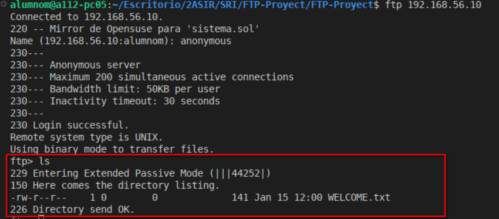<br>
Then, we tried the read permisions, making sure they work properly.
<br>
<br>

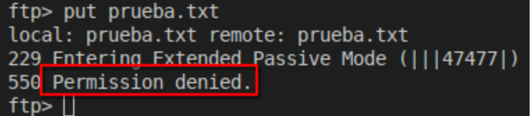<br>
Now, trying the denied write permiesion, trying to upload a file.
<br>
<br>

<br>
Also, we tried that we can donwload files normaly...
<br>
<br>

<br>
And finaly, we tried connecting to the server trough "fileZilla".
<br>
<br>

### Secure FTP server:

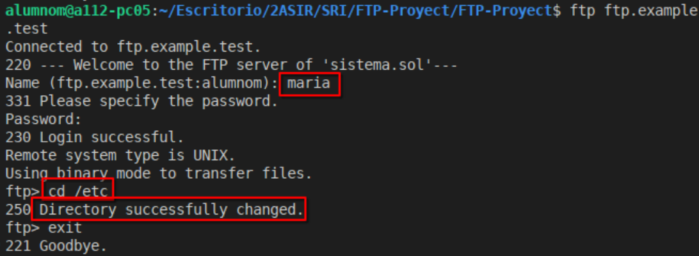<br>
After configuring and setting up the secure server, we connect trough the command line of our host, with "maria" user credentials, and test that she isn't chroot jailed.
<br>
<br>

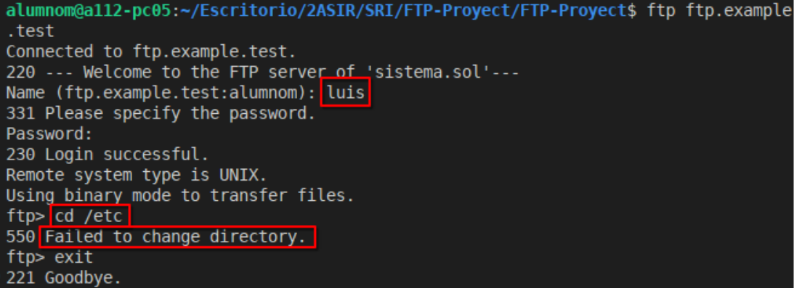<br>
Then, change into "luis" user, and test that he, indeed, is chroot jailed.
<br>
<br>

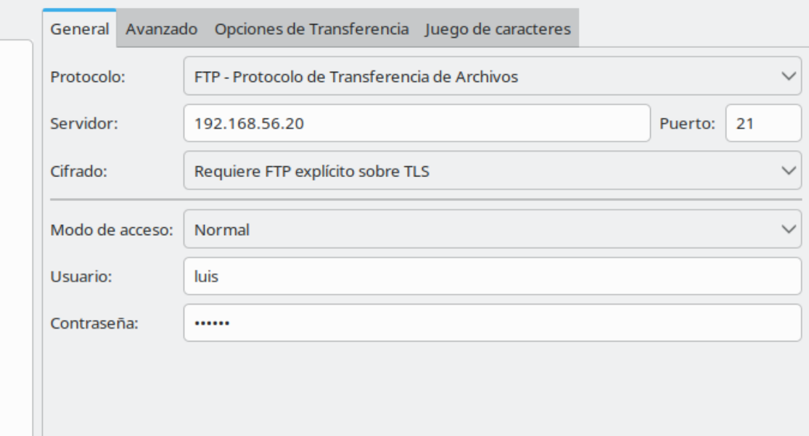
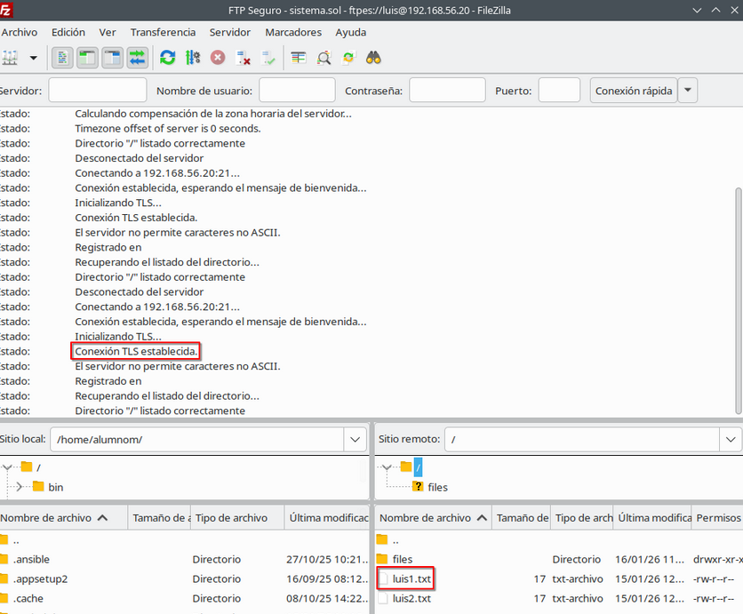<br>
Now, we connected to fileZilla, firts stablishing the site, and then loging in with the user credentials...
<br>
<br>

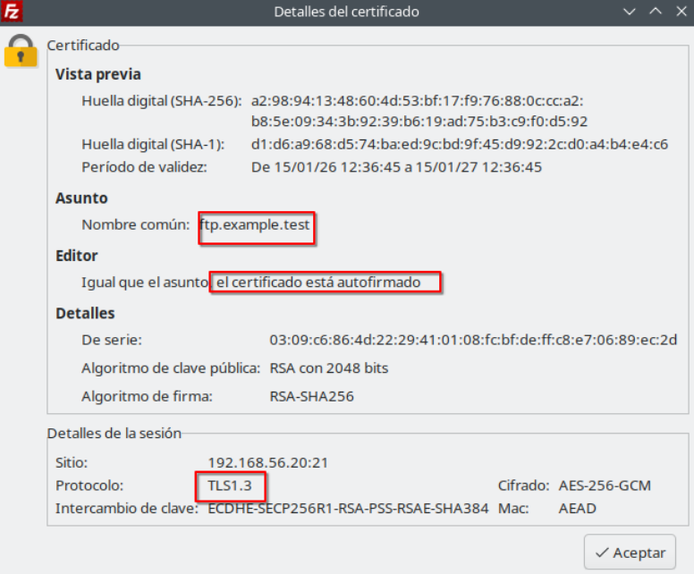<br>
Here we can see the certificate details.
<br>
<br>

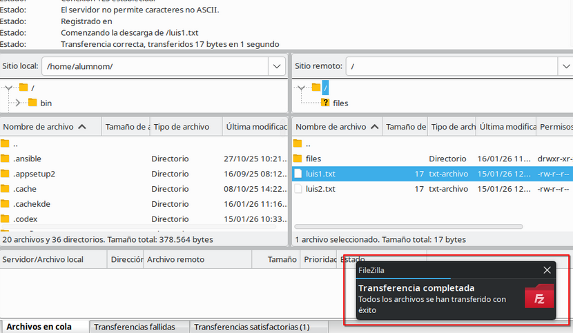
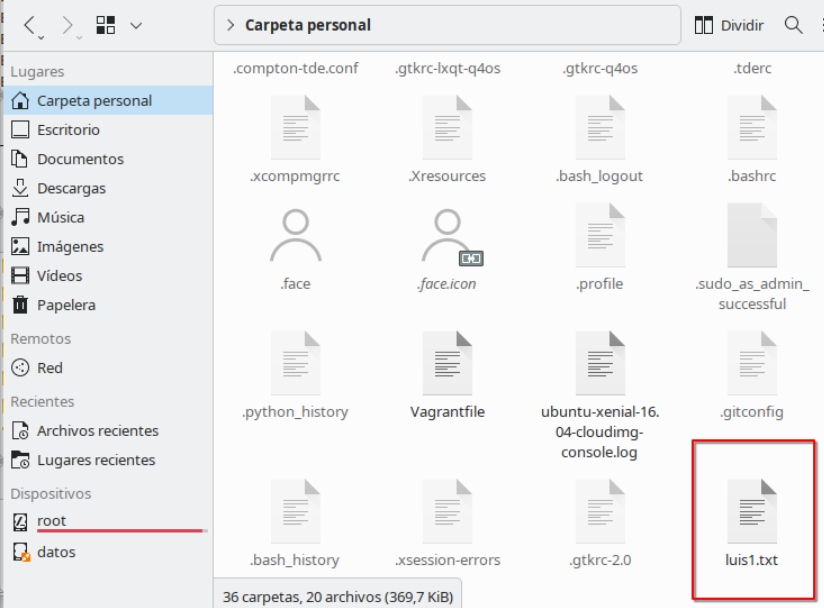<br>
After the success login, we tried donwloading a file normaly.
<br>
<br>

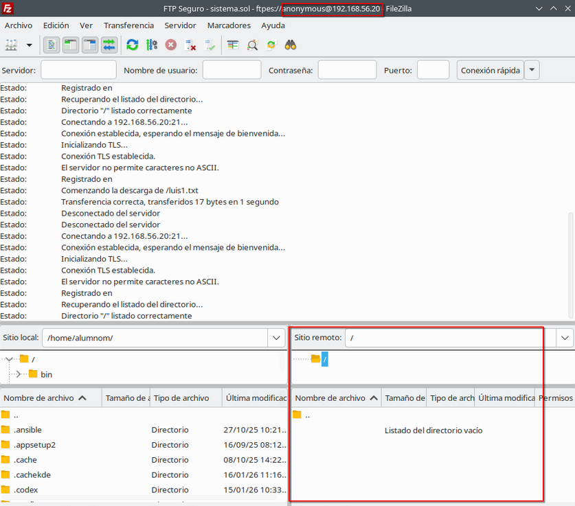<br>
And finally, we tried loging in with an anon user.
<br>
<br>

## That's all folks.
Thanks for readding, and we hope it works for you all too!

### Created by:
- Gustavo Heredia Medina
- Daniel Rodríguez Cabello

from 2º ASIR-B [[IES Zaidín Vergeles](https://www.ieszaidinvergeles.org/)].


# Práctica FTP - Servidor FTP Anónimo y Seguro (vsftpd)

Este documento describe la configuración de:

1. Servidor **FTP Anónimo**
2. Servidor **FTP Seguro (FTPS)** con usuarios locales y SSL

---

# 1️⃣ Servidor FTP Anónimo

## Instalación

```bash
sudo apt install vsftpd -y
```

---

## Crear archivo de bienvenida

Crear un archivo dentro de:

```bash
/var/ftp
```

Normalmente:

```bash
WELCOME.txt
```

Escribir el mensaje que se mostrará al conectar.

---

## Copia de seguridad de la configuración

```bash
sudo cp /etc/vsftpd.conf /etc/vsftpd.conf.bak
```

---

## Configuración de /etc/vsftpd.conf

### Editar el archivo

```bash
sudo nano /etc/vsftpd.conf
```

### Parámetros principales

```conf
listen=YES
listen_ipv6=NO

anonymous_enable=YES
local_enable=NO

write_enable=NO
anon_upload_enable=NO
anon_mkdir_write_enable=NO

anon_root=/var/ftp

max_clients=200
anon_max_rate=51200
idle_session_timeout=30
```

### Explicación

- listen=YES → Escucha por IPv4  
- anonymous_enable=YES → Permite acceso anónimo  
- local_enable=NO → No permite usuarios locales  
- write_enable=NO → No permite escritura  
- anon_upload_enable=NO → No permite subir archivos  
- anon_mkdir_write_enable=NO → No permite crear directorios  
- anon_root=/var/ftp → Directorio raíz del usuario anónimo  
- max_clients=200 → Máximo de conexiones simultáneas  
- anon_max_rate=51200 → Límite de velocidad  
- idle_session_timeout=30 → Tiempo máximo inactivo  

---

## Reiniciar servicio

```bash
sudo systemctl restart vsftpd
```

---

## Comprobar funcionamiento

```bash
systemctl status vsftpd
```

---

## Probar conexión

```bash
ftp 192.168.56.10
```

Usuario:

```bash
anonymous
```

---

# 2️⃣ Servidor FTP Seguro (FTPS)

## Instalación de paquetes necesarios

```bash
sudo apt install vsftpd openssl -y
```

---

## Crear usuario local

```bash
sudo useradd -m -s /bin/bash manolo
sudo passwd manolo
```

---

## Generar clave privada

```bash
sudo openssl genrsa -out /etc/ssl/private/example.test.key 2048
```

---

## Generar certificado autofirmado

```bash
sudo openssl req -new -x509 -key /etc/ssl/private/example.test.key -out /etc/ssl/certs/example.test.crt
```

---

## Configuración segura en /etc/vsftpd.conf

### Editar configuración

```bash
sudo nano /etc/vsftpd.conf
```

### Activar usuarios locales y escritura

```conf
local_enable=YES
write_enable=YES
```

### Activar SSL

```conf
ssl_enable=YES
rsa_cert_file=/etc/ssl/certs/example.test.crt
rsa_private_key_file=/etc/ssl/private/example.test.key
```

### Enjaular usuarios en su directorio home

```conf
chroot_local_user=YES
allow_writeable_chroot=YES
```

### Mensaje de bienvenida

```conf
ftpd_banner=Bienvenido al servidor FTP seguro
```

---

## Excepción de usuarios que NO estarán enjaulados

Editar o crear:

```bash
/etc/vsftpd.chroot_list
```

Añadir dentro el nombre del usuario que no queremos enjaular.
